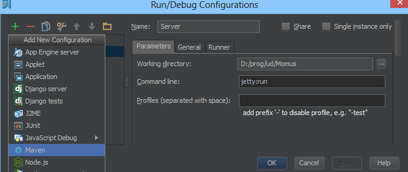
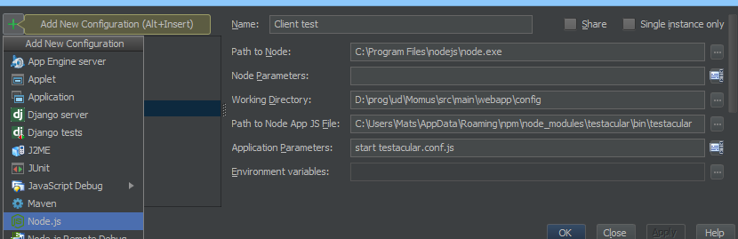
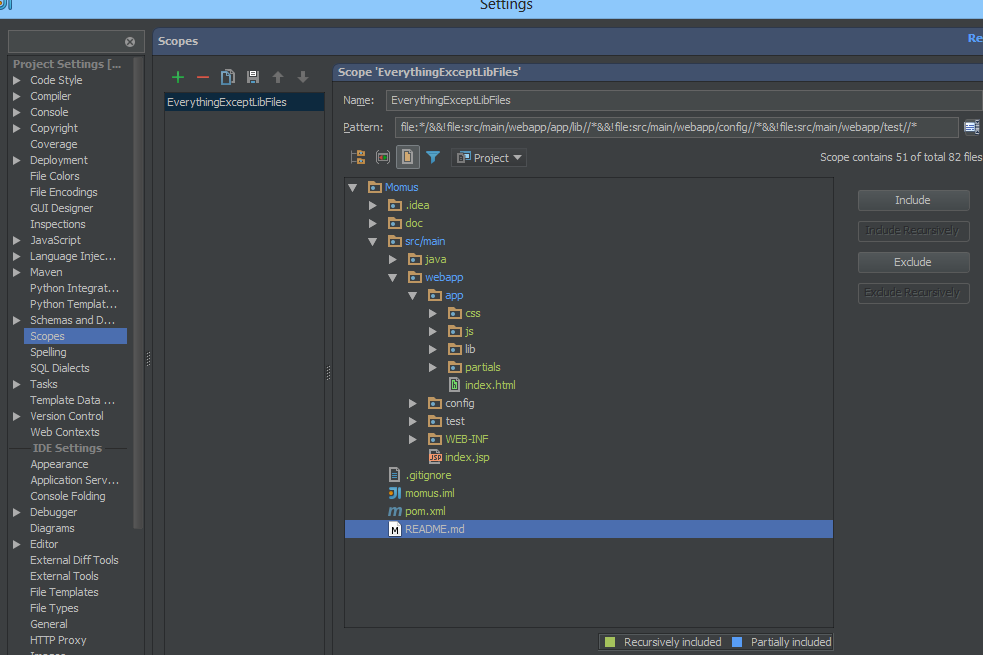

#IntelliJ Tips
Stuff to make it as easy as possible working with this project in IntelliJ.

##Plugins
These should be installed in IntelliJ

* AngularJS - Support for AngularJS, gives code completion etc.
* Markdown - View these files better
* NodeJS - To run the tests through IntelliJ

Other than that, make sure Maven, Spring, Javascript etc. plugins are enabled.

##Run Configurations

### Running the server
Create a run configuration for Maven, name it `Server` or something similar.
Working directory should be the root. The commands for it should be `jetty:run`

Then you can run the server by pressing the green arrow. However, you need to restart the server each time you make
a change to any Java-files, which is tiresome and takes time for each small change.

Instead, run the Server-configuration in **debug** mode (the bug-button next to run)!
This will allow you to Hot Swap code. This means that you can edit a Java-file and compile it, and the server will
switch to that file without needing to restart.

So, run server in debug mode, change some Java and then press ctrl+shift+f9 (Build->Compile <filename>). The debugger will say that classes were reloaded.
Note that this only works for changes inside a method. If a method signature is changed and the file recompiled, the debugger will say it cannot reload the class.
So for bigger changes the server will need to be restarted.

Go to http://localhost:8080 as usual

###Running Testacular
Create a run configuration for NodeJS.
Point to where NodeJS is installed.
The *Working Directory* should be `<root>\src\main\webapp\config`
*Path to JS file* should be testacular.
Usually in `C:\Users\<user>\AppData\Roaming\npm\node_modules\testacular\bin\testacular` on Windows.
should be `/usr/local/` etc. in Linux.
*Application Parameters* should be `start testacular.conf.js`.

When running this, a browser window will open. Just let it be in the background.
Every time a relevant file is changed, testacular will notice and rerun the affected tests.
If this doesn't happen, just press Ctrl+S in the edited file to trigger it.

If you want Testacular to run only once and then quit, `--single-run` can be added in application parameters.
Also, browsers can be specified like this `--browsers Firefox`.

##Edit Scope
Bootstrap, AngularJS, testing library etc. contains a lot of warnings, errors, TODOs, spelling mistakes etc.
Instead of having to see all that when running Analyze->Code Inspection, or when Commiting or to search in those files,
add a scope to exclude them.

Open Settings and select Scopes. Include/exclude stuff there. Here is mine:

Pattern: `file:*/&&!file:src/main/webapp/app/lib//*&&!file:src/main/webapp/config//*&&!file:src/main/webapp/test//*`

